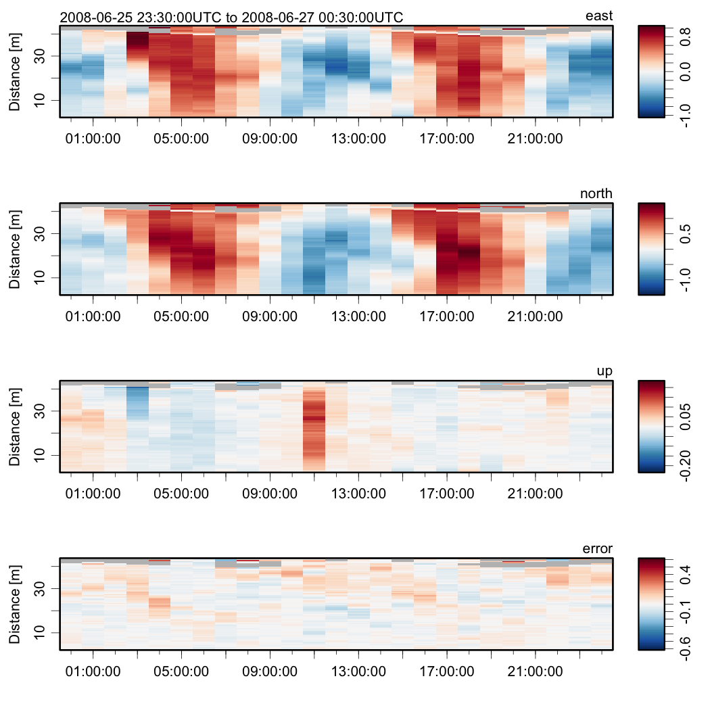
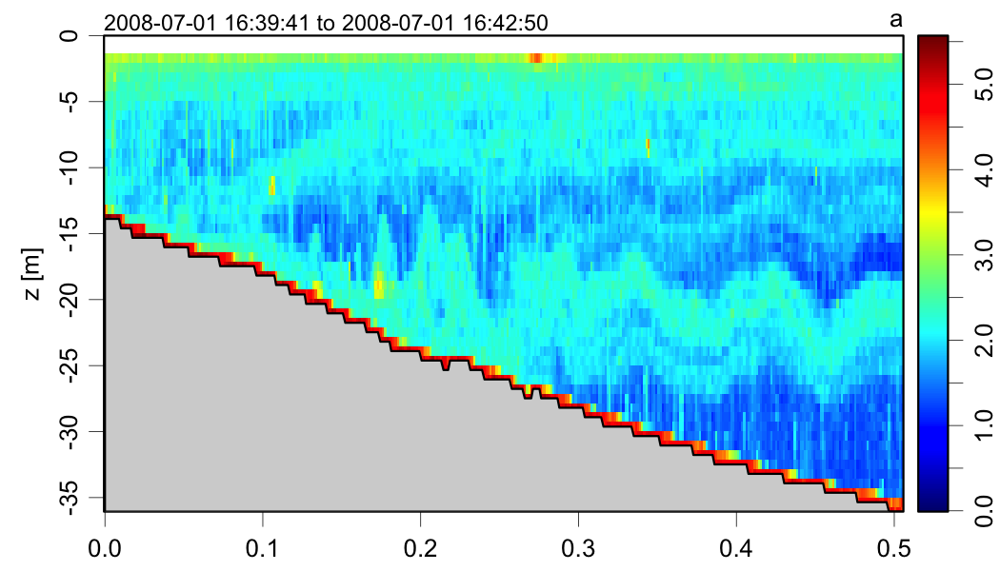

# oce 

<!-- badges: start -->

[](https://github.com/dankelley/oce/actions)
[](https://codecov.io/gh/dankelley/oce?branch=develop)
[](https://cran.r-project.org/package=oce)


[](https://www.rdocumentation.org/packages/oce)
<!-- badges: end -->


## About oce

Oce is an R package for processing oceanographic data.  Its
[webpage](https://dankelley.github.io/oce/) provides details, of which this
README file is just a sketch.  A book by one of the oce co-authors provides
more information on the package and its potential for oceanographic research
(Kelley, Dan E., 2018. [Oceanographic Analysis with
R](https://www.springer.com/us/book/9781493988426).  New York.  Springer-Verlag
ISBN 978-1-4939-8844-0).

## Installing oce

Stable versions of oce are available from CRAN, and may be installed from
within R, in the same way as other packages.  However, the CRAN version is only
updated a few times a year (pursuant to policy), so many users install the
`"develop"` branch instead. This branch may be updated several times per day,
as the authors fix bugs or add features that are motivated by day-to-day usage.
This is the branch favoured by users who need new features or who would wish to
contribute to Oce development.

The easy way to install the `"develop"` branch is to execute the
following commands in R.
```R
remotes::install_github("dankelley/oce", ref="develop")
```
and most readers should also install Ocedata, with
```R
remotes::install_github("dankelley/ocedata", ref="master")
```

## Evolution of oce

Oce is emphatically an open-source system, and so the participation of users is
very important.  This is why Git is used for version control of the Oce source
code, and why GitHub is the host for that code.  Users are invited to take
part in the development process, by suggesting features, by reporting bugs, or
just by watching as others do such things.  Oceanography is a collaborative
discipline, so it makes sense that the evolution of Oce be similarly
collaborative.

## Examples using built-in datasets

### CTD
```R
library(oce)
data(ctd)
plot(ctd, which=c(1,2,3,5), type="l", span=150)
```


### Acoustic Doppler profiler
```R
library(oce)
data(adp)
plot(adp)
```


### Sealevel and tides
```R
library(oce)
data(sealevel)
m <- tidem(sealevel)
par(mfrow=c(2, 1))
plot(sealevel, which=1)
plot(m)
```


### Echosounder
```R
library(oce)
data(echosounder)
plot(echosounder, which=2, drawTimeRange=TRUE, drawBottom=TRUE)
```



### Map
```R
library(oce)
par(mar=rep(0.5, 4))
data(endeavour, package="ocedata")
data(coastlineWorld, package="oce")
mapPlot(coastlineWorld, col="gray")
mapPoints(endeavour$longitude, endeavour$latitude, pch=20, col="red")
```


### Landsat image
```R
library(ocedata)
library(oce)
data(landsat)
plot(landsat)
```


